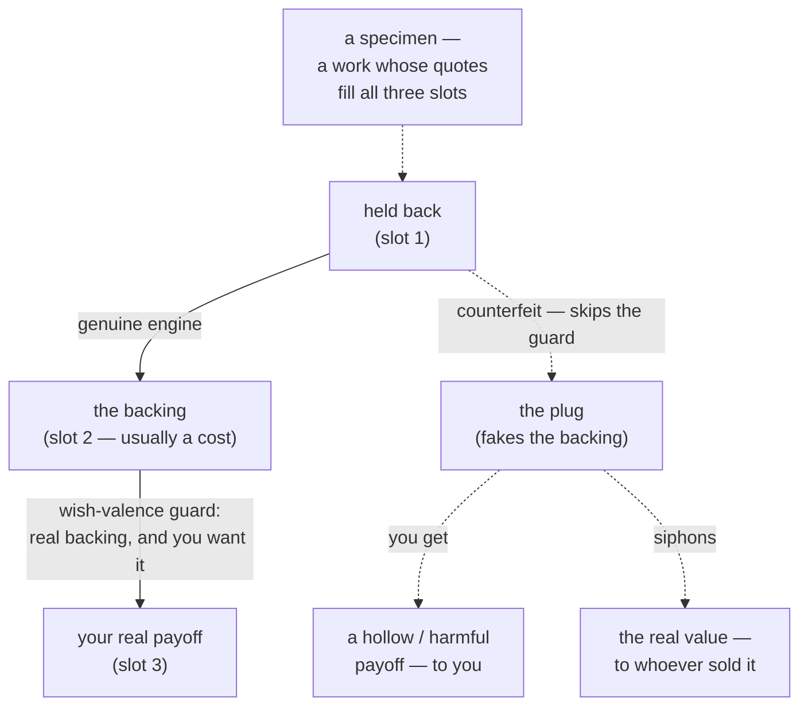

# cupel

### → [Browse the catalog](https://justinstimatze.github.io/cupel/)

A filterable, citation-gated browser of every work cupel has tagged — search by engine, by counterfeit, by evidence tier. Each card expands inline to its full review and links to its verbatim-cited dossier.

---

Every story runs on at least one wish-fulfillment **engine**: a wish *in the reader* that the story exists to gratify. It plays out on the page through a protagonist — held back, then released, then paid off — but the unit cupel names is the wish that arc delivers to *you*, not the character's goal. (That distinction matters: the craft tradition — McKee, Egri, Stanislavski — analyzes the *protagonist's* want as a tool for building plot; cupel names the *reader's* wish the story pays out.) *Pride and Prejudice* runs the wish to be undervalued and then correctly seen; *Rocky*, to become capable; *John Wick*, for permission to finally stop holding back.

cupel names which engine(s) a work runs and backs every tag with a verbatim quote — so the reading argues from the page, not from taste. It does not rate works or judge their quality; it names the wish. No quote, no tag.

**Each engine has a dark twin.** The same *pitch* that sells *being wanted* runs the pickup-artist's script; the one that sells *belonging* runs the cult's; the one that sells *a legible world* runs the conspiracy theory's. cupel calls this property **dual-use** and the dark twin **the counterfeit** — it plugs slot 2 (fakes the backing), so the engine can't turn over and the real payoff never comes. You get a hollow or harmful version instead, and usually the real value flows to whoever sold you the shortcut (your money, the cult's growth, the demagogue's followers). The shared thing is only the *wish on offer* — **not** the machinery that does the actual recruiting (coercion, isolation, networks, grievance), which no taxonomy of wishes captures. Naming the honest engine also names the grift that wears its face.

**The whole model in one picture** — the genuine **engine** runs all three slots and turns over; the **counterfeit** plugs slot 2 (fakes the backing), so the real payoff never comes:



- **engine** — the wish as a working machine (*held back → backing → payoff*); all three slots must fill for it to turn over. The unit cupel catalogs. ("Engine" and "the wish" name the same thing — the engine is the wish in working form.)
- **slot** — one of the three quote-backed conditions (*held back / backing / payoff*); a work earns the tag only when each fills with a real quote.
- **backing** (slot 2) — the real thing behind the payoff, and the term for the middle slot. **Usually a cost** you pay (mastery's regimen, redemption's atonement) — sometimes genuine substance that is simply *there* (being wanted *as you are*), which is why the general name is *backing*, not *cost*. The hinge of the whole thing — the engine has it, the counterfeit fakes it.
- **counterfeit** (the *dark twin*) — the same engine with slot 2 plugged, the backing faked: it can't turn over, so the real payoff never comes. You get a hollow or harmful version, and usually the real value is siphoned to whoever sold the shortcut.
- **wish-valence guard** — the rule that bars the shortcut: the payoff must carry its real backing (slot 2), and the protagonist must actually *want* it.
- **specimen** — a work whose text fills all three slots; the evidence an engine is real.
- (`#NNNN` is a Project Gutenberg id for an open-access primary text; `lex-NNNN` is a citation pointer into a separate vocabulary/idea-substrate project the catalog cross-references. Both are just citations — skip them on a first read.)

**One worked example.** *Pride and Prejudice* runs **repricing** — undervalued, then re-priced on a currency the market wasn't counting. The three slots — *held back → backing → payoff* — each fill with a quote (each engine renames them on its entry page; repricing's are *the dismissal / the cross-currency worth / the reversal*):

- **held back** (slot 1) — Darcy dismisses her: "tolerable: but not handsome enough to tempt me."
- **the backing** (slot 2) — her real worth, on a currency the market wasn't pricing: "For the liveliness of your mind I did" — wit, not the beauty he dismissed. (Worth she *has*, not a cost she *pays* — why the general term is "backing.")
- **the payoff** (slot 3) — the re-valuation delivered: "how ardently I admire and love you."

Three quotes, three slots, tag earned. A slot with no quote means no tag; the test stays deliberately blunt (why, under *Why slots instead of judgment*, below).

**How to slot-test a new work.** (1) Pick a candidate engine — read its three slots in the catalog. (2) Find a verbatim quote in the work that fills *slot 1* (the held-back condition). (3) Find one for *slot 2* (the backing — usually a real cost paid, sometimes substance that's simply there). (4) Find one for *slot 3* (the payoff delivered). (5) Check the wish-valence guard: does the bearer actually *want* the payoff this engine offers, and is the payoff bearer-realizable (the work passes the guard) or externally-adjudicated (it's a *solvent*, not an engine)? Three quotes plus a clean guard → `✓ slot-proven` dossier. Missing a quote → either the engine isn't running here, or it runs without textual evidence (worth flagging in prose, not as a tag).

**Texture vs engine.** What a work delivers as *experience* (awe, dread, spectacle) rides along on whichever engine drives consumption — texture is *what the work feels like*, engine is *what people consume it for*. Confusing one for the other coerces slot-tests; the discipline is the **demand-side test** (the engine is the wish-about-life people bring to the work, not the texture they get from it). Full treatment in `theory/texture-vs-engine.md`.

**What it's for.** The output is a browsable, cited database of works tagged by the wish they run — `cupel render` builds it (the *bechdeltest.com* model, generalized from one pass/fail axis to a taxonomy). It's for arguing about what a story is *for* **from the page, not from taste**: critics and students who want a claim grounded in a quote, writers reverse-engineering a payoff, and anyone who wants the [dual-use map](theory/cluster-catalog.md) of how the same wishes get sold as grifts.

*The name.* A *cupel* is the porous bone-ash cup that cupellation burns ore down in, leaving a *bead* of pure metal — the same operation, run on a story. Each work-card opens with **The bead** — the concentrated distillation the reading extracts, with the engines named and the dross burned off. The catalog is what the operation leaves behind, growing one slot-test at a time.

---

## Five paragons to start with

If you only read five cards, read these — five distinct engines, all slot-proven, spanning the catalog's analytical range:

- **[*Pride and Prejudice*](works/pride-and-prejudice.md)** — **repricing** at the framework's worked example. The market mis-prices Elizabeth as "tolerable: but not handsome enough"; the novel pays in a different currency (her wit) and delivers Darcy's reversal. The clean single-engine specimen.
- **[*The Wonderful Wizard of Oz*](works/the-wonderful-wizard-of-oz.md)** — **homecoming/reunion**, the canonical specimen of the wish for *home as home*. Dorothy is offered beautiful Oz and chooses gray Kansas; the engine isolates from belonging by the choice itself.
- **[*Les Misérables*](works/les-miserables.md)** — **redemption** at Western canon's maximum extension. The bishop's grace, the lifetime of substantive cost, the deathbed under the candlesticks; the engine paid in a thousand pages of substantive labor.
- **[*Watchmen*](works/watchmen.md)** — **apotheosis-antagonist-mode + impunity-antagonist-mode** at the multi-bearer register. The catalog's showcase of *antagonist-mode*: engines run as deconstruction rather than enabling, the work earning its enabling status by the prosecution.
- **[*Notes from Underground*](works/notes-from-the-underground.md)** — **wound**, the catalog's *gratify-by-refusing-to-give* axis at its purest specimen. The Underground Man preserves his wound through every cure offered; refusing the engine's payout *is* the payout.

---

## The engines

That's the framework. What follows is the catalog — the confirmed engines and the counterfeit each carries, **ordered by how often the catalog has tagged them so far** (not because the corpus has to be balanced, but because count is a soft indicator of how heavily a wish runs in popular fiction). Each engine links to its full entry on the site: three slots, wish-valence guard, specimens, and the dual-use counterfeit shown.

(Underneath: each engine is the *supply-side* product gratifying a real *demand-side* drive — `theory/the-claim.md`; full counterfeit demonstrations in `theory/counterfeit-catalog.md`.)

| engine — the wish | counterfeit — the grift wearing its face |
|---|---|
| [apotheosis](https://justinstimatze.github.io/cupel/engines/apotheosis/) | "unlock your god-mode" |
| [mastery](https://justinstimatze.github.io/cupel/engines/mastery/) | social-Darwinism |
| [order/legibility](https://justinstimatze.github.io/cupel/engines/order-legibility/) | the conspiracy theory |
| [impunity](https://justinstimatze.github.io/cupel/engines/impunity/) | the ideology of unaccountable power |
| [belonging](https://justinstimatze.github.io/cupel/engines/belonging/) | the cult |
| [repricing](https://justinstimatze.github.io/cupel/engines/repricing/) | resentment / grievance-populism |
| [redemption](https://justinstimatze.github.io/cupel/engines/redemption/) | cheap grace |
| [being-desired](https://justinstimatze.github.io/cupel/engines/being-desired/) | manufactured desire (PUA / looksmaxxing) |
| [liberation/autonomy](https://justinstimatze.github.io/cupel/engines/liberation-autonomy/) | manufactured liberation / false freedom ("forced to be free") |
| [wound](https://justinstimatze.github.io/cupel/engines/wound/) | performative-victimhood / trauma-grifting |
| [purity/contamination](https://justinstimatze.github.io/cupel/engines/purity-contamination/) | the purity spiral / scapegoating |
| [abundance](https://justinstimatze.github.io/cupel/engines/abundance/) | the luxe life minus the means |
| [virtue of defeat](https://justinstimatze.github.io/cupel/engines/virtue-of-defeat/) | ressentiment / sanctified grievance |
| [unleashing](https://justinstimatze.github.io/cupel/engines/unleashing/) | grievance-radicalization |
| [the double life](https://justinstimatze.github.io/cupel/engines/the-double-life/) | the secret-superior grift |
| [legacy/transcendence](https://justinstimatze.github.io/cupel/engines/legacy-transcendence/) | "your name will be remembered" martyrdom |
| [caretaking/being-needed](https://justinstimatze.github.io/cupel/engines/caretaking-being-needed/) | manufactured dependence / paternalism |
| [homecoming/reunion](https://justinstimatze.github.io/cupel/engines/homecoming-reunion/) | manufactured reunion (the séance) / restoration politics |
| [security/safety](https://justinstimatze.github.io/cupel/engines/security-safety/) | the protection racket |
| [recognition](https://justinstimatze.github.io/cupel/engines/recognition/) | simulated recognition (PUA "I see the real you" / cult-recruiter "we see you") |

These are the **confirmed** engines — each has cleared the gate: a clean specimen checked against the page, a wish-valence guard, and the counterfeit shown. Excluded candidates and result-types are in `theory/falsification-log.md`. (A slash — order/legibility, legacy/transcendence, purity/contamination, security/safety — marks a **compound**: one engine named by its two inseparable facets, not a choice between two names.) Each engine's full entry — the three slots with quotes, the wish-valence guard, the specimens, and the dual-use counterfeit shown — lives at the linked `/engines/<slug>/` page on the site; this README does not reproduce it, so the substrate stays the single source of truth.

Engines compose. A work can fill more than one engine's slots; tag all that fill. *Carrie* fills repricing (bullied, dismissed) and unleashing (the pig's blood is the trigger). Counterfeits compose too, and harder: a clean novel pays one or two wishes, but a real recruitment operation stacks every lure that works — a cult runs belonging *and* purity *and* the secret-superior grift *and* legacy at once. The one-to-one engine↔counterfeit pairing in the table above is the *catalog's* bookkeeping unit, not a claim that real grifts arrive single-engine.

**Candidate engines** — reasoned hypotheses, some with a clean specimen already — are tracked in `theory/falsification-log.md`. They promote here only when they clear the gate. Every confirmed engine above was once a candidate; wound is the catalog's first **gratify-by-refusing-to-give** axis and produced the result-types typology consolidated in `theory/result-types.md`.

A slot-test can resolve several ways: *confirmed* (clears every gate → the table above), *candidate* (promising, not yet proven → `theory/falsification-log.md`), *composite* (the wish decomposes into existing engines — e.g. *fame* = being-desired + repricing), **solvent** (the wish is real but its counterfeit dissolves into other engines, so it is named honestly yet kept out of the table — *election*, *vindication*, *justice/comeuppance*, which share one shape: an external **verdict** the bearer cannot self-confer — *chosen* / *proven-right* / *desert-served*), and **vehicle** (not a wish but a *delivery device* — *transport* carries you to a new world; *transformation* is the crucible by which other engines render their payoff). The counterfeit is a *hard* gate: a wish is admitted only if it has a *distinct* counterfeit — so the one-to-one engine↔counterfeit pairing is the gate's **output**, not a symmetry assumed for neatness. **Where that line falls is the actual finding**: a wish has a counterfeit exactly when its payoff is *bearer-realizable* (worth, desire, competence — things you can fake in private) and lacks one when the payoff is *externally-adjudicated* (a verdict only someone else can render — the solvents above). That line, not the tidy 1:1 count, is the load-bearing claim. The per-case hunts are in `theory/falsification-log.md` and `theory/counterfeit-catalog.md`.

## Why slots instead of judgment

The Bechdel test needs no interpretation because it tests surface, countable features (two named women, who talk, not about a man) rather than judging theme. cupel borrows the *move* — locate text, fill the slots, don't adjudicate whether the engine "really" applies — but is honest that it does not reach Bechdel's decidability: the analyst still chooses which engine to test and which reading a quote supports (is Darcy's later love a *different* trait, or the same attraction re-weighted?). The claim is **more disciplined than taste, not interpretation-free**: the slot forces the argument onto a citable quote, where a second reader can contest it.

The cost is bluntness, in both directions. A subtle case with no on-the-record line is a **false negative**, the way the Bechdel test misses many films. And blunt surface-reading carries a built-in **false-positive** class: irony and unreliable narration supply quotes that are locally accurate but globally inverted — Humbert Humbert's surface monologue fills being-desired's slots immaculately, and the work undercuts every one of them. Lolita sat in the catalog's "resister" bucket for exactly this reason until the wound graduation (2026-06-05) named what was actually running — `works/lolita.md`. The wish-valence guard is what catches these: *would the bearer accept the engine's payoff at no cost?* — yes → engine; no → the work is undercutting the surface-fill. Both kinds of error are deliberate trade-offs of a blunt instrument; the ironic cases are flagged in the entry's prose, and contested readings are displayed (two citations for one slot), not resolved. Nuance lives in the prose; the tags stay dumb and queryable.

**What cupel is not.** Not a theory of *tension* or suspense — that is the mechanics of engagement (will they get it?), orthogonal to *which* wish the payoff gratifies. Not *plot structure* — Freytag's rising-action/climax is the sequence of beats, not the wish. Not the protagonist's dramatic *objective* — the craft canon (McKee, Egri, Stanislavski) analyzes the character's want; cupel names the reader's wish the story pays out. And not *theme* — the slots read surface, not message. The method itself is plain structuralism (Propp → Greimas → Barthes); the novelty is the axis and the dual-use gate, not slot-decomposition.

## Prior art, and what's new

That stories run on a small set of recurring structures is old and well-mapped, and cupel stands on that work: Aristotle's *Poetics*; Propp's *Morphology of the Folktale*; Campbell's monomyth (and Vogler's screenwriting descendant); Polti, Booker, Vonnegut/Reagan. Three precedents sit closest of all to the *wish* axis and must be named: Cawelti's genre "moral fantasies" (*Adventure, Mystery, and Romance*); **Greimas's actantial model** (narrative sorted by the structure of *desire* — subject, object, sender, receiver); and the **reader-response** tradition (Radway's *Reading the Romance*, on the wish a genre gratifies its reader). Desire is also the bedrock of the writing-craft canon — McKee's *Story*, Egri, Stanislavski's "objective" — where "a character who *wants* something" is the engine of plot. On the demand side cupel leans on motivation psychology (Maslow; Ryan & Deci), Gazzaniga's left-hemisphere interpreter (the demand-side substrate — the engines are templates the interpreter uses for self-story construction; `theory/interpreter-and-engines.md`), and, for the counterfeits, the propaganda/radicalization literature (Hoffer, Ellul, Kruglanski).

So "sort by desire" is **not** new — Greimas, Cawelti, and Radway each did a version. cupel's honest deltas are narrower and specific: (1) it sorts by the **reader's gratified wish**, not the protagonist's dramatic objective — the craft canon analyzes the character's *want*; cupel names what the *audience* is paid; (2) it **decouples** that wish from genre (Cawelti's unit stays genre-shaped — a revenge thriller and a courtroom drama can run the same engine, two "mysteries" different ones); (3) the **dual-use** overlay — each engine paired with the counterfeit that sells its payoff without the backing, gated by the bearer-realizable line; (4) a **citation-gated, falsification-tested** protocol for assigning it. The slot-*decomposition* itself is plain structuralism (Propp → Greimas → Barthes); the novelty is the axis plus the dual-use gate, not the method. Full positioning, delta by delta, in `lit-review.md`.

## Layers

A work sits at two layers, and an engine can run on either:

| engine | content — the wish inside the story | consumption — the work as a badge you hold |
|---|---|---|
| apotheosis | *A Court of Mist and Fury* | manifest "god-mode" to *feel* limitless |
| mastery | *Robinson Crusoe* | own the course to *feel* capable |
| order/legibility | *The Red-Headed League* | trade conspiracy lore to *feel* awake |
| impunity | *The Invisible Man* | adopt the "48 Laws" pose to *feel* untouchable |
| belonging | found-family | buy the critique to *be* a dissident |
| repricing | *Pride and Prejudice* | read hard books to *be* smart |
| redemption | *A Christmas Carol* | perform the apology to *feel* absolved |
| being-desired | *Twilight* | curate a persona to *feel* wanted |
| liberation/autonomy | *Narrative of the Life of Frederick Douglass* | strike the rebel pose to *feel* unbound |
| wound | *Lolita*, *A Little Life*, *Notes from the Underground* | brand the trauma as identity to *feel* deep |
| purity/contamination | *Dracula* | denounce the impure to *feel* clean |
| abundance | *Ali Baba* | curate the appearance of plenty to *feel* wealthy |
| virtue of defeat | *Apology* | wear the wound as a badge to *feel* righteous |
| unleashing | *John Wick* | revenge media to feel like a sheepdog |
| the double life | *The Scarlet Pimpernel* | hoard esoteric lore to *feel* one of the awakened few |
| legacy/transcendence | *The Iliad* | follow a martyr-cause to *feel* your name will endure |
| caretaking/being-needed | *Charlotte's Web* | take a dependent under your wing to *feel* needed |
| homecoming/reunion | *The Odyssey* | curate a nostalgia to *feel* you can go home again |
| security/safety | *Treasure Island* | stockpile against the coming threat to *feel* safe |
| recognition | *Giovanni's Room*, *Stone Butch Blues*, *On Earth We're Briefly Gorgeous* | curate the "I see you" signal to *feel* witnessed |

The consumption row can't be slot-tested from the text, because the wish lives in the reader's real-world behavior rather than in the work. Its gate — does holding the badge **substitute** for the commitment it signals, or **enable** it? where does the value flow? — stays an explicitly subjective section, kept out of the mechanical test. The content engines can be made *more disciplined than taste* — argued from a citable quote — but not interpretation-free (see *Why slots*, above); the consumption layer can't even reach that, and pretending otherwise would defeat the point.

## Works

One file per work under `works/`. See `works/pride-and-prejudice.md` for the format. Every quote is verified against a primary source (public-domain texts pulled directly; others cited to edition and location). Each file has two sections: `## The reading` distills the work into the product-tier card (the bead + engines + bundle + dual-use read + verdict) and `## The evidence` (present when `backing: slot-proven`) is the verbatim-cited dossier — exhaustive, every slot filled with a primary-source quote. The reading distills; the evidence proves. The merged shape is documented in `works/_format.md`.

The project's central claim is in `theory/the-claim.md`; structural decisions in `theory/decisions.md`; working method in `theory/method.md`; known blind spots in `theory/blind-spots.md`.

## Status

Spec stage. The engines above are the **confirmed** set — each has at least one clean specimen checked against the page, a wish-valence guard, and its counterfeit shown, with every quote verified verbatim against a primary source. Public-domain texts are quoted directly; in-copyright ones are cited by bibliographic identity, with only short excerpts quoted under fair use for criticism and commentary — the full texts are never reproduced or redistributed. The per-engine specimens, Gutenberg ids, guards, and counterfeits live on the linked `/engines/<slug>/` pages on the site; the candidate frontier is in `theory/falsification-log.md`.

Two logs keep the spec honest. **Falsification** (`theory/falsification-log.md`): the guards exist because some works fill the bare slots and still shouldn't be tagged — *A Christmas Carol* fills both unleashing's and belonging's loose slots yet is redemption; a pregnancy (*A Court of Silver Flames*) fills progeny's yet is peril, not the longed-for-child wish. Both are **excluded** — the guard earning its keep. And the guards are not only retrospective patches: the principle they encode (the bearer-realizable line) then *predicted in advance* — it called impunity, abundance, and virtue of defeat **engines**, and election, vindication, and justice **solvents**, before each hunt was run, and the hunts confirmed the calls. (What's still missing, in fairness: an inter-rater study and a base-rate/null model.) **Dual-use** (`theory/counterfeit-catalog.md`): each counterfeit shown on a page, always the same shape — slot-3 identity minus slot-2 backing.

The **works format** — one file per work with both layers — has a spec and worked examples in `works/_format.md`: the reading distills the work into a concise, engine-tagged card (the bead + engines run + the bundle + the mandatory dual-use read), with an **evidence tier** on every tag (`✓ slot-proven`, backed by the same file's `## The evidence` section, vs `~ reviewed`, asserted from secondary sources and not yet slot-validated). The evidence proves; the reading distills, and the tier marker keeps the two from blurring. Dogfooded on `works/pride-and-prejudice.md` (clean single engine) and `works/the-scarlet-pimpernel.md` (a bundle).

How the catalog grows — in brief: candidate engines are slot-tested and either promoted, or recorded as **solvents** (a real wish whose counterfeit dissolves into other engines — election, vindication, justice/comeuppance) or **vehicles** (a delivery device, not a wish — transformation, transport). The negative results are logged as carefully as the promotions; that discipline is the point. A separate experiment, `cmd/cupel`, applies the lens *live* — with a limit it cannot escape: by the thesis above, the honest pitch and the grift **share the register**, so register alone cannot tell a sermon from a cult, or an organizer from a demagogue (the discriminating signal — where the value flows — is non-textual, and stays out of the mechanical test). It surfaces *register-overlap* as a prompt to ask that question, never as a verdict that something is recruitment.

The surface is a browsable, filterable per-work database — engine tags + cited evidence per work, contested readings shown (the *bechdeltest.com* evidence-per-entry model, generalized from one pass/fail axis to the multi-engine taxonomy). It's built in two stages: `cupel build-data` parses the `works/` and `theory/` markdown into a JSON catalog (`works.json`, `engines.json`, `glossary.json`, etc.) with `cupel/cmd` as the single source of truth, so counts and engine tags cannot drift; the `web/` directory then renders that JSON via Astro + Tailwind + shadcn (filter by engine + evidence tier + search; each card expands inline to its reading; per-work pages render reading + evidence with slot quotes as styled blockquotes; a plain-language glossary fronts the vocabulary). As more `~` reviewed-tier cards land, the same pipeline scales the surface with no code change.

## Contributing

After a fresh clone, install the pre-commit + pre-push hooks (gofmt / vet / build / works-lint / tag-audit / quotes-audit / calque vocab-check on commit; tests on push — same checks CI runs):

```
git config core.hooksPath scripts/git-hooks
```

Override for an emergency commit with `SKIP_HOOKS=1 git commit ...` — CI will still gate the push.

## License

cupel's own code and prose are released under the MIT License (see `LICENSE`). Quoted excerpts from third-party works — the in-copyright fiction cited in the works — remain the property of their respective rights-holders and are reproduced only as short excerpts, under fair use for criticism and commentary; they are not covered by the MIT grant.
