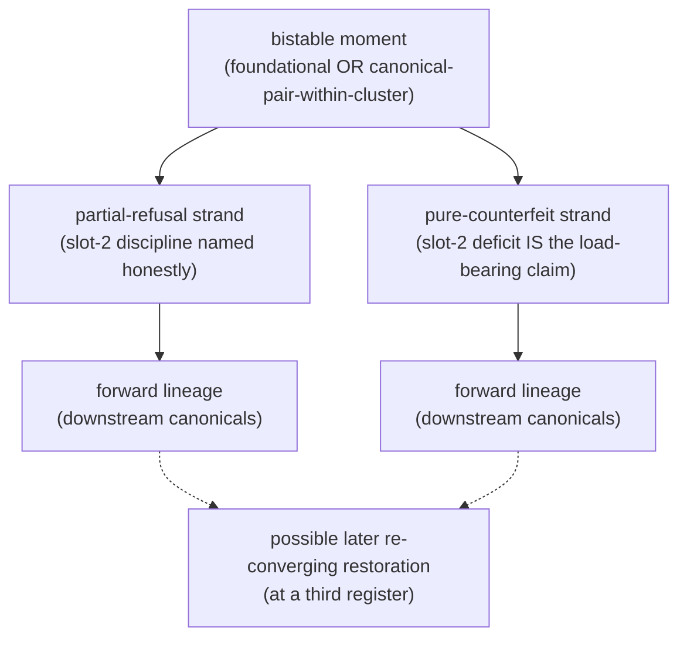

# Foundational-moment bistability — what the finding claims, and how to test it elsewhere

**The move.** The self-help cluster's nine-decade canonical-text trace surfaced a finding that complicates the catalog's earlier sequential-evolution framing: the cluster's foundational moment **splits** at opposite poles of the partial-refusal ↔ pure-counterfeit dimension. Carnegie *How to Win Friends* (1936) and Hill *Think and Grow Rich* (1937) emerged one year apart at *opposite poles*; both achieved canonical status; both have forward downstream lineages. The cluster is *bistable from its foundation*; the canonical lineage runs as a **braid**, not as a sequence.

This document names the finding precisely, the textual signatures that distinguish the poles, the test that would confirm or falsify the finding for another cluster, and the slot-test queue.

## What "foundational-moment bistability" claims

A cluster's canonical-text lineage is **bistable from its foundational moment** if, at that moment:

1. **Two canonical texts emerge within a narrow time window** (≤ ~3 years), both achieving canonical-text status within the cluster.
2. **Both texts run the cluster's spine engines**, but at **opposite poles of the partial-refusal ↔ pure-counterfeit dimension**:
   - One text runs **slot-2 partial-refusal** at some register (local-principle, structural-frame, or trainable-craft — any honest accounting of the slot-2 cost)
   - The other text runs **slot-2 pure-counterfeit** with no partial-refusal at any register — the slot-2 deficit is the load-bearing claim itself
3. **Both poles have forward canonical lineages**, with downstream canonical-text successors at the same poles.
4. **The lineages can meet again** at a later canonical text that *abandons both partial-refusal registers* and restores the cluster at a different register (e.g., Clear's trainable-craft restoration in 2018).

The claim is structural, not historical-contingent: a cluster's foundational moment is *expected* to be bistable, because the wish the cluster sells is *simultaneously* available in honest-partial-refusal form and dishonest-pure-counterfeit form, and both forms are commercially viable from the cluster's birth.

Worked anchor at the self-help cluster's 1936-37 moment: Carnegie *How to Win Friends* (partial-refusal pole, local-principle register) + Hill *Think and Grow Rich* (pure-counterfeit pole) → Covey 1989 (partial-refusal forward, structural-frame register) + Byrne 2006 (pure-counterfeit forward) → Clear 2018 (re-convergence at trainable-craft register).

## The self-help anchor — textual signatures

The bistable-braid finding is grounded in two slot-proven dossiers ([How to Win Friends and Influence People](/cupel/works/how-to-win-friends-and-influence-people/), [Think and Grow Rich](/cupel/works/think-and-grow-rich/)) at the cluster's 1936-1937 moment.

### Partial-refusal pole — Carnegie 1936

The textual signature is an **explicit slot-2 discipline** running across a substantial passage, at the local-principle register: the *flattery vs sincere appreciation* discipline (ll. 3438–3524). Carnegie names the partial-refusal *inside* an individual principle: appreciation works only when it is sincere; flattery does not work because the recipient detects the absence of the slot-2 work (genuine attention, genuine valuation). The principle's effectiveness depends on the partial-refusal being honored; the technique is not "say nice things to get what you want" but "do the underlying attentional work, then express it sincerely."

Forward lineage: Covey *7 Habits* (1989) elevates Carnegie's local-principle partial-refusal to the **structural-frame register** — the Character-Ethic-vs-Personality-Ethic distinction becomes the book's organizing claim, the partial-refusal lifted from inside a principle to the book's frame.

### Pure-counterfeit pole — Hill 1937

The textual signature is the **explicit naming of self-deception as the discipline's substance**, with no partial-refusal at any register. Hill writes that "you can deceive your own subconscious mind" through autosuggestion — the slot-2 deficit (self-deception substituting for substantive achievement) is the load-bearing claim itself, not hidden. The "secret formula" works *by* installing self-belief without slot-2 grounding; the recipient of the technique becomes the agent of their own deception.

Forward lineage: Byrne *The Secret* (2006) compresses Hill's pure-counterfeit pole into mass-market deliverable; the prosperity-gospel canon extends the pole into Christian-televangelical form; contemporary manifestation-canon extends it further.

### Re-converging restoration — Clear 2018

Clear *Atomic Habits* (2018) restores Carnegie's named-protocol structure at the trainable-craft register but drops both partial-refusal registers (local-principle AND structural-frame). The braid's two strands meet again at the consumption-layer register Clear establishes: trainable-craft with neither partial-refusal anchor. This is not the *closing* of the braid (both partial-refusal and pure-counterfeit lineages continue alongside Clear); it is a third register the canonical-text lineage now admits.

## What confirms or falsifies the finding for another cluster

A bistability test for cluster X requires:

1. **Foundational-moment identification.** Name the moment when cluster X's first canonical-text specimens emerged. The moment is identified by *retrospective canonical recognition*, not by author intent. Use the cluster's own forward-lineage claims as the anchor.

2. **Candidate pair-naming.** Within ~3 years of that moment, identify candidate canonical-text pairs that **both** achieved canonical status. If only one canonical text exists at the moment, the cluster is *mono-foundational* (a falsification of the bistable-braid finding's generality).

3. **Pole verification via slot-test.** Slot-test each candidate against cluster X's engines, applying the dossier discipline. The textual signature of partial-refusal: the dossier finds an explicit slot-2 discipline running across a substantial passage, in *honest* form — the technique's effectiveness depends on the partial-refusal being honored. The textual signature of pure-counterfeit: the dossier finds the slot-2 deficit *named as the load-bearing claim*, with no partial-refusal at any register.

4. **Forward-lineage verification.** Both poles, if confirmed, should have downstream canonical specimens. If only one pole has a forward lineage, the cluster is *bistable-but-one-pole-extincts* (a refinement, not a falsification).

5. **Re-convergence check.** Does the cluster have a later canonical text (per Clear 2018 for self-help) that abandons both partial-refusal registers and restores at a different register? If so, document the register.

The test is structural; it does not require LLM-fluency-trap-prone qualitative comparison. Each dossier slot-proves its own claim; the comparison is between the slot-tests, not between the texts at the LLM level.

## Slot-test queue for other-cluster bistability tests

### Test #1 — Startup-canon (highest leverage, partial-primary-text verification)

**Foundational moment candidates:** the catalog names Drucker *Practice of Management* (1954) as foundational. A bistability test at 1954 would require:
- **Pole-A candidate**: Drucker 1954 — **CONFIRMED partial-refusal pole 2026-06-06** (slot-tested at [The Practice of Management](/cupel/works/the-practice-of-management/)). Three-leg-plus-mastery cluster gravitational center (apotheosis + mastery + order/legibility) runs substantively at the partial-refusal pole; impunity-leg structurally absent (the same Ries-2011 discriminator). The catalog hypothesis holds.
- **Pole-B candidate**: a 1953-1956 canonical text running the pure-counterfeit pole. Candidates: Norman Vincent Peale *The Power of Positive Thinking* (1952 — within the window, but typically classified self-help not startup-canon); David Ogilvy *Confessions of an Advertising Man* (1963 — too late); Sloan *My Years with General Motors* (1964 — too late). **Open question 2026-06-06:** if no startup-canon-internal 1953-1956 pure-counterfeit canonical text exists, the original-form 1954 moment is *partial-refusal-pole-monosourced* — a refinement, not a falsification, of the bistable-braid generalization. The cluster's bistability would then be *delayed*, with the pure-counterfeit pole emerging at the modern moment (Thiel 2014) rather than the foundational moment.

**Alternate foundational moment**: the **modern startup-canon's** founding moment is arguably Ries *Lean Startup* (2011) + Thiel *Zero to One* (2014), a three-year window. Status: both slot-tested, both extracted, both slot-proven ([The Lean Startup](/cupel/works/the-lean-startup/), [Zero to One](/cupel/works/zero-to-one/)).

- **Ries 2011** is hypothesized **partial-refusal pole**: build-measure-learn / pivot / validated-learning are slot-2 disciplines that honor the partial-refusal (the technique's effectiveness depends on the iterative slot-2 work being done honestly; vanity metrics are explicitly diagnosed as the counterfeit).
- **Thiel 2014** is slot-proven as the cluster's **pure-counterfeit pole** (contrarian-truth-as-evidence, monopoly-as-virtue, foundation-of-Singapore reference) — the slot-2 deficits (no falsification mechanism for contrarian-truth claims; monopoly justification's circularity) are the load-bearing claims.

If the modern moment confirms bistability with Ries + Thiel at opposite poles, the finding generalizes at least to canonical-pair-moments within an established cluster (a refinement of the original claim, which spoke specifically of foundational moments).

**Cleanest next step**: extract Ries EPUB to `refs/Ries-2011-LeanStartup.txt`, slot-test Ries against startup-canon, compare against Thiel dossier, write [The Lean Startup](/cupel/works/the-lean-startup/) graduating from the existing [The Lean Startup](/cupel/works/the-lean-startup/) ~ reviewed card.

**Result (2026-06-02): Test #1 confirms in its alternate form.** Ries 2011 dossier at [The Lean Startup](/cupel/works/the-lean-startup/) fills three of four startup-canon cluster legs against the verbatim text: apotheosis at the **partial-refusal pole** (the cluster's founder-mythology explicitly named and rejected — *"the stories in the magazines are lies"*, *"selection bias and after-the-fact rationalization"*, *"entrepreneurship is a kind of management"*); mastery + order/legibility filling **substantively**, with the slot-2 counterfeit (*vanity metrics*, *success theater*) explicitly named at the structural-frame register as the danger the methodology exists to displace. The fourth leg — impunity — is **structurally absent**: no monopoly-as-virtue, no founder-class exemption from competition ethics, no authorization of deception. The impunity-leg's presence-or-absence is the cleanest operational distinguisher between the two poles at this canonical-pair moment.

**Generalization claim updated.** The original bistability finding was anchored at the self-help cluster's *foundational moment* (Carnegie 1936 + Hill 1937). The Ries-Thiel test confirms bistability at the startup-canon cluster's *canonical-pair moment within an established cluster* (2011-2014). The finding's claim-shape generalizes: when two canonical texts emerge within a narrow window at opposite poles of the partial-refusal ↔ pure-counterfeit dimension, both achieving canonical-text status, the cluster is bistable at that moment — whether the moment is foundational or canonical-pair-within-an-established-cluster. The *bistable-braid* metaphor stays; the cluster's canonical lineage runs as parallel partial-refusal-pole and pure-counterfeit-pole strands.

**The two-strand finding** flagged at the prior [The Lean Startup](/cupel/works/the-lean-startup/) phase is now confirmed at the slot-test level: heroic-founder strand (Thiel-anchored, pure-counterfeit pole, with forward lineage through Horowitz / Isaacson-Jobs / Blitzscaling) running alongside methodology strand (Ries-anchored, partial-refusal pole, with forward lineage through Blank / Maurya / the broader Lean-Startup-method franchise). Forward-lineage verification at both poles pending primary-text verification + slot-test of additional specimens.

### Test #2 — Protected-world (not yet slot-tested)

**Foundational moment candidates** (modern American right's foundational moment, ~1960-1964 window):
- **Goldwater *The Conscience of a Conservative*** (1960) — hypothesized partial-refusal pole (constitutional-restraint as slot-2 discipline; the technique's effectiveness depends on the restraint being honored)
- **Schlafly *A Choice Not An Echo*** (1964) — hypothesized pure-counterfeit pole (the kingmakers-conspiracy as the load-bearing claim; slot-2 deficit named as the framework's substance)

**Status**: neither slot-tested; both in-copyright but likely trackable.

Alternative earlier moment: Hayek *Road to Serfdom* (1944) + Burnham *The Managerial Revolution* (1941). Status: Hayek likely trackable; Burnham harder.

### Test #3 — Cult cluster (not yet slot-tested)

**Foundational moment**: the catalog names Dianetics 1950 as the modern cult cluster's foundational canonical text. The opposite-pole 1950 candidate is unclear without research. Candidate moments to investigate:
- **1950 window** (one year): what contemporaneous 1949-1951 text ran cult-cluster legs at the partial-refusal pole?
- **Earlier foundational moment**: Mary Baker Eddy *Science and Health* (1875, PD) + ? — Christian Science as proto-cult-cluster foundational text; opposite-pole 1875-era candidate would be early-spiritualist canon. Status: Eddy PD, available; opposite-pole research needed.

### Test #4 — Compression cluster (#7) (mostly PD, mostly-already-available)

The compression cluster was added 2026-06-01 via Tolle slot-test. Its foundational moment is genuinely open — the cluster compresses established wisdom traditions, so its foundational moment is *the first moment a Western popular-press canonical text successfully compressed a source tradition*.

Candidates for the foundational moment (early 20th century, much in PD):
- **Hesse *Siddhartha*** (1922, PD) — Buddhist compression via fictional bildungsroman; hypothesized partial-refusal pole (the fictional frame honors the slot-2 work, leaving the source tradition's practice intact as the "true" path)
- **Suzuki *Essays in Zen Buddhism*** (1927, in-copyright) — Zen compression via expository essays; pole assignment unclear without slot-test
- **Yogananda *Autobiography of a Yogi*** (1946, in-copyright) — Hindu compression via autobiography
- **Watts *The Wisdom of Insecurity*** (1951, in-copyright) — Zen compression via Western-philosophy synthesis

Status: Hesse PD and available; others require acquisition.

### Test #5 — Seduction-mastery (likely mono-foundational, narrow test)

The catalog's slot-proven specimens (Strauss *The Game* 2005, Tomassi *The Rational Male* 2013) are 8 years apart — not a foundational-moment pair. The actual foundational moment of the seduction-mastery cluster is earlier:
- **Eric Weber *How to Pick Up Girls!*** (1970) — proto-PUA self-help
- **Ross Jeffries Speed Seduction system** (1989-1993) — formalized NLP-PUA
- **The Game** (2005) — narrative-canonicalization

A 1970 moment with Weber and a single canonical alternative is harder to bistable-pair. The cluster may be *mono-foundational with delayed bistability* (Strauss 2005 + Tomassi 2013 as the bistable pair occurring decades after the cluster's birth). Status: Weber not yet slot-tested; Jeffries materials self-published and harder to locate.

### Test #6 — Romance-trap (narrative-cluster, distinct test)

The romance-trap cluster runs at the narrative level, not the recruitment level. The bistability test may not apply directly — narrative clusters have story-form gravitational centers, not recruitment-cluster gravitational centers (per [Cluster catalog](/cupel/theory/cluster-catalog/) the romance-trap cluster). If bistability is a recruitment-cluster property, the romance-trap cluster's foundational moment may not be bistable in the same sense. Open question; out of scope for the immediate test sequence.

## Methodological-discipline points

1. **Slot-test, do not LLM-compare.** Each candidate text is slot-tested independently against the cluster's spine engines; the bistability finding is then read off the slot-test results, not generated by qualitative pairwise comparison. The dossier discipline (per `memory/quotes-only-no-paraphrase`) is in force at every layer.

2. **Forward lineage must be evidenced.** A bistability claim is incomplete without forward-lineage canonical specimens at both poles. Naming the pair is half the work; tracing the forward lineage of each pole is the other half.

3. **Mono-foundational is a real result.** If a cluster's foundational moment is mono-foundational (a single canonical text with no contemporaneous opposite-pole canonical), the finding is *bistable-braid is self-help-specific or near-specific*, not *bistable-braid is generic across clusters*. Per `memory/keep-gates-hard-name-new-categories`, name the new result honestly rather than forcing bistability where the texts don't support it.

4. **The braid metaphor is provisional.** If the test confirms bistability for multiple clusters with consistent forward-lineage shape (parallel poles with later re-convergence at a third register), the braid metaphor stays. If the structures vary (some pure-bistable-no-reconvergence, some bistable-with-three-poles, some asymmetric-bistable), name the variations rather than papering over them.

## Mechanism refinement — narrative-laundered non-fiction

Reading across the slot-proven catalog surfaces an empirical correlation along the partial-refusal ↔ pure-counterfeit pole dimension: **the pure-counterfeit pole tends to be narrative-saturated; the partial-refusal pole tends to be narrative-refusing.**

### The pattern across slot-proven specimens

- **Hill 1937** — saturated. The Andrew-Carnegie-bestowing-the-secret narrative; the Master Mind story-shape; the formula-with-hero structure. The "lessons" are story-embedded.
- **Thiel 2014** — saturated. Founder-as-monopoly-builder hero; contrarian-truth-quest; competition reframed as antagonist.
- **Hubbard 1950** — extreme case. Space-opera engram backdrop inside ostensibly therapeutic framework.
- **Voliva-era flat-earth materials** — saturated. Prophet-gift narrative inside science-truth claim.
- **Carnegie 1936** — counter. Techniques cataloged; partial-refusal honored at local-principle register; low narrative-saturation.
- **Ries 2011** — counter. *Explicitly names founder-mythology as the cluster's danger and rejects it.* The structural-frame register's load-bearing move is anti-narrative.
- **Clear 2018** — counter. Trainable craft delivery; low narrative-saturation.
- **Covey 1989** — partial. The "principles" frame is somewhat narrative-anchored but the discipline runs structural.

### What the non-fiction wrapper does

The recruitment mechanism the pattern suggests: at the pure-counterfeit pole, a story does the load-bearing recruitment work (hero / antagonist / quest / reward), and the *non-fiction-genre wrapper* protects the story from the discipline that would apply to fiction. Sovereign Individual 1997 gets cited by economists; reframed as fantasy-of-escape it would be reviewed in a different register. Zero to One is taught in business schools as ideas-book; reframed as founder-heroism quest it would get a different reading. Think and Grow Rich is shelved as personal development; reframed as a parable of an old man bestowing a secret it is the genre it is. The genre-laundering is the cover-mechanism.

### Why this is a mechanism refinement, not a new dimension

The finding does not open a new axis. It names one of the specific mechanisms by which the pure-counterfeit pole achieves recruitment without slot-2 work: the story does the recruiting, and the non-fiction wrapper exempts the story from the discipline that would apply to fiction. The partial-refusal pole at all three registers (local-principle, structural-frame, trainable-craft) is correspondingly less narrative-dependent — its recruitment runs through technique-discipline, not through hero-quest structure.

Provisional name: **narrative-laundered non-fiction**. The kernel is fiction-grade; the wrapper is non-fiction-grade; the wrapper exempts the kernel from the fiction-discipline that would otherwise apply.

### What this predicts for the Sovereign Individual constellation

The Sovereign Individual constellation's canonical-text spine (see [Cluster catalog](/cupel/theory/cluster-catalog/) for the constellation entry) is a clean test set. The prediction: Davidson + Rees-Mogg 1997, Srinivasan 2022, Friedman + Quirk 2017, and Yarvin's patchwork essays should all show explicit hero / antagonist / quest / reward narrative structure inside their predictive-analysis or political-philosophy genre-framing. If they do, the narrative-laundering finding gains a fourth and fifth confirmation outside the original self-help and startup-canon contexts.

### Methodological caveat

The finding is empirical-correlation observed across the existing slot-proven catalog, not itself a slot-test grade. It does not change the dossier discipline (verbatim slot-anchors only). It predicts that future dossier work will *find* narrative-saturation evidence at the pure-counterfeit pole and *not* at the partial-refusal pole, which is testable each time a new pole-assigned specimen is added.

## Open work — ranked

1. ~~Extract Ries 2011 EPUB and slot-test against startup-canon~~ **Done 2026-06-02** — [The Lean Startup](/cupel/works/the-lean-startup/) slot-proven; bistability test #1 alternate-foundational-moment form confirms. Forward-lineage verification at the partial-refusal pole pending primary-text verification of Blank *Four Steps to the Epiphany* (2005) and Maurya *Running Lean* (2012).
2. **Slot-test Drucker *Practice of Management* (1954)** for Test #1's original-foundational-moment form. Less time-critical given the alternate form has confirmed.
3. **Slot-test Goldwater (1960) + Schlafly (1964)** for Test #2 (protected-world cluster bistability test).
4. **Slot-test Hesse *Siddhartha* (PD, 1922)** for Test #4's foundational-moment candidate (compression cluster).
5. **Research the 1950 cult-cluster window** to identify candidate opposite-pole texts for Test #3.
6. **Forward-lineage verification at the startup-canon partial-refusal pole**: slot-test Blank (2005) and Maurya (2012); slot-test against the partial-refusal pole's textual signatures (slot-2 counterfeit named at the structural-frame register; impunity-leg absent). Confirms or refines the two-strand finding.
7. **Narrative-laundering test at the Sovereign Individual constellation spine**: when the spine texts (Davidson + Rees-Mogg 1997, Srinivasan 2022, Friedman + Quirk 2017, Yarvin patchwork essays) are slot-tested, document the explicit hero / antagonist / quest / reward structure inside each text's analytical or political-philosophy wrapper. Four-or-five-text confirmation outside self-help and startup-canon promotes the narrative-laundering finding from empirical-correlation to named mechanism of the pure-counterfeit pole.

Cross-reference: [Cluster catalog](/cupel/theory/cluster-catalog/) (the self-help cluster self-help bistability finding; Open Work item #5); [How to Win Friends and Influence People](/cupel/works/how-to-win-friends-and-influence-people/) + [Think and Grow Rich](/cupel/works/think-and-grow-rich/) (the slot-proven anchor pair); [The 7 Habits of Highly Effective People](/cupel/works/the-7-habits-of-highly-effective-people/) + [Atomic Habits](/cupel/works/atomic-habits/) (the forward-lineage and re-convergence specimens); [The Lean Startup](/cupel/works/the-lean-startup/) (the ~ reviewed card Ries would graduate from); [Zero to One](/cupel/works/zero-to-one/) (the existing slot-proven pole for Test #1's alternate form).
